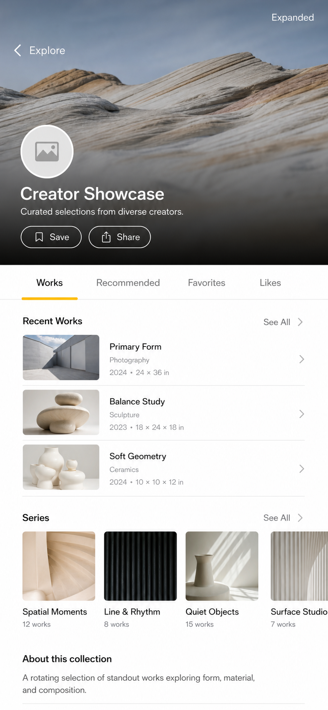
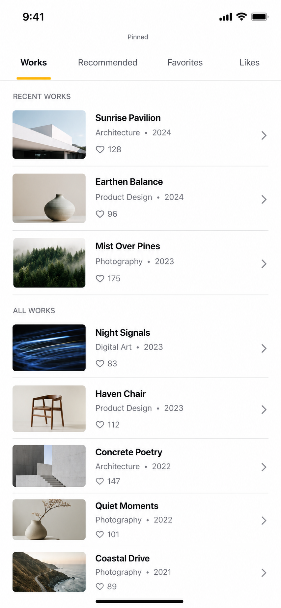
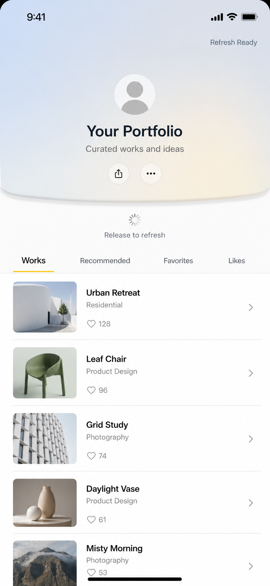

# CollapsiblePager UI 设计与动画交互 DSL

本文档定义 `CollapsiblePager` 的默认 UI 体验、动画交互规则和可交付给开发的 DSL 契约。它不替代技术架构文档，而是把需求中的容器能力转译成可执行的界面与动效规格。

## 1. 文档目标

- 为第一版 `CollapsiblePager` 提供一套通用、非业务绑定的默认 UI 设计。
- 明确 Header 折叠、TabBar 吸顶、Tab 指示器、横向分页和下拉刷新的交互细节。
- 输出 UI DSL 和动画交互 DSL，作为后续 UIKit 实现、单元测试和 demo 验证的共同语言。
- 所有关键设计决策均用引用标记对应到需求文档。

## 2. 引用标记

| 标记 | 来源 |
| --- | --- |
| `[REQ-1]` | [背景：通用容器，不绑定个人主页业务](requirements-and-architecture.md#1-背景) |
| `[REQ-2]` | [目标：可折叠 Header、多 Tab、分页、刷新、布局刷新](requirements-and-architecture.md#2-目标) |
| `[REQ-2.1]` | [技术要求：iOS 13、UIKit 主 actor、安全并发](requirements-and-architecture.md#21-技术要求) |
| `[REQ-3]` | [第一版非目标](requirements-and-architecture.md#3-第一版非目标) |
| `[REQ-4]` | [核心用户故事](requirements-and-architecture.md#4-核心用户故事) |
| `[REQ-5.1]` | [可折叠 Header](requirements-and-architecture.md#51-可折叠-header) |
| `[REQ-5.2]` | [TabBar](requirements-and-architecture.md#52-tabbar) |
| `[REQ-5.3]` | [TabBar 位置](requirements-and-architecture.md#53-tabbar-位置) |
| `[REQ-5.4]` | [Tab 指示器](requirements-and-architecture.md#54-tab-指示器) |
| `[REQ-5.5]` | [Child 页面](requirements-and-architecture.md#55-child-页面) |
| `[REQ-5.6]` | [下拉刷新](requirements-and-architecture.md#56-下拉刷新) |
| `[REQ-5.7]` | [横向分页](requirements-and-architecture.md#57-横向分页) |
| `[REQ-5.8]` | [导航栏与安全区](requirements-and-architecture.md#58-导航栏与安全区) |
| `[REQ-6]` | [隐性需求与边界场景](requirements-and-architecture.md#6-隐性需求与边界场景) |
| `[REQ-8]` | [配置模型](requirements-and-architecture.md#8-配置模型) |
| `[REQ-9]` | [内部架构](requirements-and-architecture.md#9-内部架构) |
| `[REQ-10]` | [行为矩阵](requirements-and-architecture.md#10-行为矩阵) |
| `[REQ-12]` | [第一版实现范围](requirements-and-architecture.md#12-第一版实现范围) |
| `[REQ-14]` | [推荐默认值](requirements-and-architecture.md#14-推荐默认值) |
| `[REQ-15]` | [设计原则](requirements-and-architecture.md#15-设计原则) |

## 3. 设计定位

`CollapsiblePager` 是一个通用 UIKit 容器。默认 UI 必须足够完整，可以直接用于个人主页、详情页、创作者主页等场景；同时不能把头像、背景图、用户信息、作品列表等业务元素写死进组件。Header 和 child 页面由业务方提供，组件只负责容器布局、TabBar、指示器、滚动协调和刷新触发。`[REQ-1]` `[REQ-15]`

默认视觉语言采用 iOS 原生、克制、内容优先的组件风格：系统背景色、系统字体、48pt TabBar、短下划线指示器和清晰的 selected 无障碍状态。业务方可以替换 Header 内容、Tab 样式和指示器，但默认组件本身不带强品牌感。`[REQ-5.2]` `[REQ-5.4]` `[REQ-14]`

## 3.1 UI 效果图

以下效果图用于表达默认体验和关键状态，不表示组件内置业务样式。图中的图片、头像、标题、按钮和列表内容都是示例业务视图；核心组件只提供 HeaderSlot、TabBarSurface、IndicatorLayer、PageContainer 和滚动协调能力。`[REQ-1]` `[REQ-15]`

### 展开态

Header 完整展示，TabBar 位于 Header 下方，当前 child 页面从 TabBar 下方开始。该状态用于验证最大 Header 高度、默认 TabBar、短下划线指示器和 child 内容布局。`[REQ-5.1]` `[REQ-5.2]` `[REQ-5.4]`



### 吸顶态

Header 完全折叠，TabBar 吸顶到导航栏或安全区下方，child 页面继续纵向滚动。该状态用于验证吸顶阈值、TabBar 固定位置和内容不重叠。`[REQ-5.3]` `[REQ-5.5]` `[REQ-5.8]`



### 刷新准备态

Header 已完全展开后继续下拉，才进入刷新准备状态。该状态用于验证“先展开 Header，再触发刷新”的交互优先级。`[REQ-5.1]` `[REQ-5.6]` `[REQ-10]`



## 4. 信息架构与组件层级

```text
CollapsiblePagerViewController
└─ CollapsiblePagerRootView
   ├─ HeaderSlot
   │  └─ BusinessHeaderView
   ├─ TabBarSurface
   │  ├─ TabItem[0...n]
   │  └─ IndicatorLayer
   └─ PageContainer
      └─ ChildViewController[0...n]
         └─ pagerScrollView
```

### 4.1 HeaderSlot

HeaderSlot 是业务 Header 的容器，只管理尺寸、可见高度、折叠进度和布局刷新。默认实现不向 Header 内部注入业务 UI。业务 Header 可以根据 `collapseProgress` 自行改变头像、标题、按钮、背景图等视觉状态。`[REQ-5.1]` `[REQ-9]`

第一版默认 Header 高度为 `maxHeight = 260`、`minHeight = 0`。当 Header 完全折叠时，HeaderSlot 不保留额外视觉占位；TabBar 进入吸顶位置。`[REQ-14]`

### 4.2 TabBarSurface

TabBarSurface 位于 Header 与 PageContainer 之间，默认高度 `48pt`，背景色为 `systemBackground`，底部分隔线可开启。它不属于任何 child 页面，因此切换页面时 TabBar 不跟随 child 重建。`[REQ-5.2]` `[REQ-8]`

第一版默认使用等宽文本 Tab。Tab 数量变化、屏幕旋转、Dynamic Type 变化后重新测量 item frame 与 indicator frame。`[REQ-5.2]` `[REQ-6]`

### 4.3 TabItem

TabItem 是可点击、可访问的页面入口。选中状态必须由 TabItem 自身表达，不能只依赖下划线。`[REQ-5.2]` `[REQ-6]`

默认样式：

| 状态 | 字体 | 颜色 | 无障碍 |
| --- | --- | --- | --- |
| normal | `UIFont.preferredFont(forTextStyle: .subheadline)` | `secondaryLabel` | `button` |
| selected | 同字号 semibold | `label` | `button + selected` |
| highlighted | selected/normal 颜色降低 12% alpha | 保持当前语义 | `button` |
| disabled | normal 字体 | `tertiaryLabel` | `button + notEnabled` |

### 4.4 IndicatorLayer

默认指示器是一条短下划线，宽度 `28pt`，高度 `3pt`，圆角 `1.5pt`，底部贴近 TabBar 底边，颜色默认 `systemYellow`。指示器只表达视觉焦点，不拥有选择逻辑。`[REQ-5.4]` `[REQ-14]`

横向滑动时，指示器按照 `fromItemFrame` 到 `toItemFrame` 连续插值。点击 Tab 时，指示器使用可中断动画移动到目标 item。连续点击时取消旧动画，目标更新为最后一次点击。`[REQ-5.4]` `[REQ-10]`

### 4.5 PageContainer

PageContainer 承载 child view controller，负责横向分页区域和 child 生命周期挂载。当前 child 的主滚动视图通过 `CollapsiblePagerScrollProviding` 明确提供。组件可以在后续阶段做自动查找，但第一版设计以显式协议为主。`[REQ-5.5]` `[REQ-12]`

## 5. 布局规则

### 5.1 默认布局

默认布局为 `belowHeader + pinBelowNavigationBar(0)`：Header 在顶部展开，TabBar 位于 Header 下方并占据布局高度；向上滚动时 Header 先折叠，TabBar 随 Header 上移，直到吸顶到导航栏下方或安全区顶部。`[REQ-5.3]` `[REQ-5.8]` `[REQ-14]`

```text
expanded:
┌────────────────────────┐
│ Header visible 260pt    │
├────────────────────────┤
│ TabBar 48pt             │
├────────────────────────┤
│ PageContainer           │
└────────────────────────┘

pinned:
┌────────────────────────┐
│ Navigation/Safe Area    │
├────────────────────────┤
│ TabBar 48pt             │
├────────────────────────┤
│ PageContainer           │
└────────────────────────┘
```

### 5.2 Header 折叠进度

折叠进度定义为：

```text
collapseProgress = clamp(
  (headerMaxHeight - headerVisibleHeight) / (headerMaxHeight - headerMinHeight),
  0,
  1
)
```

`0` 表示完全展开，`1` 表示完全折叠。Header 视觉变化由业务 Header 消费该进度，容器只保证进度稳定、连续、限制在 `0...1`。`[REQ-5.1]` `[REQ-9]`

### 5.3 Child 内容 inset

组件负责 child scroll view 的 content inset 策略，不依赖 `automaticallyAdjustsScrollViewInsets`。child 的顶部 inset 必须能让短内容和空内容仍然可以 bounce，并在允许刷新时达到刷新触发阈值。`[REQ-5.6]` `[REQ-5.8]`

布局刷新、横竖屏变化、Dynamic Type 变化和 Header 高度变化必须走同一套 invalidation 路径，避免不同入口产生不同 offset 行为。`[REQ-6]` `[REQ-9]`

## 6. 交互状态

| 状态 | 进入条件 | 用户可见结果 | 退出条件 | 引用 |
| --- | --- | --- | --- | --- |
| `expanded` | Header 可见高度等于最大高度 | Header 完整显示，TabBar 在 Header 下方 | 用户向上滚动 | `[REQ-5.1]` |
| `collapsing` | 向上滚动且 Header 未到最小高度 | Header 跟随手指折叠，child 暂不消费向上滚动 | Header 到最小高度 | `[REQ-5.1]` |
| `pinned` | Header 已折叠到最小高度 | TabBar 吸顶，child 正常纵向滚动 | child 回到顶部并继续向下拉 | `[REQ-5.3]` `[REQ-5.8]` |
| `expanding` | child 已到顶部后继续向下拉 | Header 跟随手指展开 | Header 到最大高度 | `[REQ-5.1]` `[REQ-10]` |
| `pullingToRefresh` | Header 完全展开且 child 在顶部后继续下拉 | 刷新控件进入准备状态 | 松手超过阈值或回弹取消 | `[REQ-5.6]` |
| `refreshing` | 超过阈值并释放 | 当前刷新 owner 进入刷新中 | `endRefreshing` 或 child 自行结束 | `[REQ-5.6]` `[REQ-10]` |
| `pagingInteractive` | 用户横向拖拽 PageContainer | 页面、Tab selected progress、指示器连续联动 | 拖拽提交或取消 | `[REQ-5.7]` |
| `pagingProgrammatic` | 点击 Tab 或调用 `selectPage` | 页面横向动画切换，指示器同步移动 | 动画完成或被新目标中断 | `[REQ-5.7]` |
| `reloadingLayout` | Header 内容、尺寸、安全区或 Tab 数据变化 | 重新计算布局，默认保持视觉位置 | 布局应用完成 | `[REQ-5.1]` `[REQ-6]` |

## 7. 动画设计

### 7.1 动效原则

- 手势驱动的 Header 折叠、展开和横向分页不使用固定 duration，直接跟随手指位移。
- 程序化切换使用短时、可中断动画，优先响应最新用户意图。
- 布局刷新默认不制造戏剧化动效，重点是保持视觉位置稳定。
- 刷新动效使用系统 `UIRefreshControl` 语义或业务 child 自己的 refresh control，不额外创造第二套刷新视觉。

### 7.2 默认动效参数

| 动效 | 触发 | Duration | Curve | 可中断 | 引用 |
| --- | --- | --- | --- | --- | --- |
| `headerFollowScroll` | 纵向拖拽 | `interactive` | `linearByGesture` | 是 | `[REQ-5.1]` |
| `tabIndicatorTapMove` | 点击 Tab | `0.25s` | `easeInOut` | 是 | `[REQ-5.4]` `[REQ-14]` |
| `tabIndicatorInteractiveMove` | 横向滑动 | `interactive` | `linearByGesture` | 是 | `[REQ-5.4]` |
| `pageTapSwitch` | 点击 Tab 切页 | `0.28s` | `easeOut` | 是 | `[REQ-5.7]` |
| `pageSwipeSettle` | 横向滑动释放并提交 | `0.20s-0.30s` | `deceleration` | 系统手势控制 | `[REQ-5.7]` |
| `layoutReloadImmediate` | 默认 Header 布局刷新 | `0s` | `none` | 不适用 | `[REQ-8]` |
| `layoutReloadAnimated` | 显式 animated 配置 | 调用方提供 | `easeInOut` | 是 | `[REQ-8]` |
| `refreshReveal` | 下拉刷新 | `interactive` | `systemRefresh` | 由系统控制 | `[REQ-5.6]` |

### 7.3 Header 视觉联动建议

容器不实现业务 Header 内部动画，但建议业务 Header 按以下进度映射。该建议用于 example app 或业务接入，不是核心包强制行为。`[REQ-1]` `[REQ-5.1]`

| 元素 | `progress = 0` | `progress = 1` | 插值建议 |
| --- | --- | --- | --- |
| 背景图 | 完整显示 | 上移或淡出 | `translateY = -24 * progress`, `alpha = 1 - 0.35 * progress` |
| 大标题 | 完整显示 | 淡出 | `alpha = 1 - progress` |
| 紧凑标题 | 隐藏 | 显示 | `alpha = max(0, (progress - 0.65) / 0.35)` |
| 头像 | 原始尺寸 | 缩小或淡出 | `scale = 1 - 0.18 * progress` |
| 操作按钮 | 正常 | 紧凑或隐藏 | `alpha = 1 - 0.6 * progress` |

## 8. 关键交互规格

### 8.1 纵向滚动仲裁

向上滚动时，滚动 delta 优先由 Header 消费，直到 Header 折叠到最小高度；剩余 delta 才交给当前 child scroll view。向下滚动时，当前 child 先回到顶部；child 到顶部后，Header 才展开；Header 完全展开后，继续下拉才进入刷新判断。`[REQ-5.1]` `[REQ-5.6]` `[REQ-9]`

实现时需要区分用户手势产生的 offset 和组件主动修正的 offset，避免递归触发滚动协调。`[REQ-9]`

### 8.2 Tab 点击切换

点击未选中 Tab 后，TabItem 立即进入目标 selected 表达，PageContainer 和 IndicatorLayer 开始程序化动画。若动画过程中再次点击其他 Tab，旧动画取消或更新，最终停留在最后一次目标页面。`[REQ-5.4]` `[REQ-5.7]`

切换完成后才提交 `selectedIndex` 并通知 delegate。若业务需要即时反馈，可以在内部维护 `pendingSelectedIndex`，但公开 selected 状态以最终提交结果为准。`[REQ-9]`

### 8.3 横向滑动切换

横向拖拽时，PageContainer 输出 `fromIndex`、`toIndex` 和 `progress`，TabBar 使用该进度插值指示器 frame。滑动取消时，TabItem 和指示器回到来源 item；滑动提交时，selected index 更新到目标 item。`[REQ-5.7]` `[REQ-10]`

纵向滚动手势和横向分页手势需要保持方向判定，正常使用中不能互相抢夺。`[REQ-5.7]`

### 8.4 下拉刷新

刷新触发的前置条件是：Header 完全展开、当前 child 在顶部、没有已有 refresh owner、当前配置允许刷新。`.overall` 模式触发 pager owner；`.child` 模式仅当当前 child 支持 `CollapsiblePagerRefreshableChild` 时触发 child owner。`[REQ-5.6]` `[REQ-10]`

Header 未完全展开时的下拉动作只展开 Header，不触发刷新。短内容和空内容 child 仍需允许 bounce 到刷新阈值。`[REQ-5.6]` `[REQ-6]`

### 8.5 Header 布局刷新

Header 内容变化后调用 `reloadHeaderLayout`。默认策略为 `.immediate + .preserveVisualPosition`：重新测量 Header、更新 TabBar frame、pin threshold、child inset 和 offset 修正，同时避免用户看到页面跳动。`[REQ-5.1]` `[REQ-8]` `[REQ-10]`

如果变化发生在用户拖拽中，应优先延迟应用或无动画应用；如果发生在横向切页中，应应用全局布局，并在切换完成后同步目标 child。`[REQ-6]` `[REQ-10]`

## 9. UI DSL

### 9.1 DSL 定位

UI DSL 是设计到实现之间的契约，不是 Swift 运行时代码。它描述组件结构、默认视觉、布局策略和状态规则。实现时可以把它转译为配置默认值、布局单元测试和 demo 场景。

### 9.2 DSL 语法约定

```text
component <Name> {
  slot <name> accepts <type>
  token <name> = <value>
  layout <name> { ... }
  visual <part> { ... }
  state <name> { ... }
  interaction <name> { ... }
}
```

### 9.3 CollapsiblePager UI DSL

```text
component CollapsiblePager {
  platform UIKit
  minimumOS iOS(13)
  concurrency mainActorForUIKit

  slot header accepts UIView fromDataSource
  slot tabBar owns TabBarSurface
  slot pages accepts UIViewController[] fromDataSource

  token header.maxHeight = 260pt
  token header.minHeight = 0pt
  token tabBar.height = 48pt
  token tabBar.background = UIColor.systemBackground
  token tabBar.separator.visible = true
  token tabItem.font.normal = preferredFont(subheadline, regular)
  token tabItem.font.selected = preferredFont(subheadline, semibold)
  token tabItem.color.normal = UIColor.secondaryLabel
  token tabItem.color.selected = UIColor.label
  token indicator.color = UIColor.systemYellow
  token indicator.height = 3pt
  token indicator.cornerRadius = 1.5pt
  token indicator.width = fixed(28pt)
  token indicator.bottomInset = 0pt

  layout default {
    placement.tabBar = belowHeader
    pinning.tabBar = pinBelowNavigationBar(offset: 0pt)
    pageContainer.top = tabBar.bottom
    childScroll.insets = managedByPager
    safeArea = respected
    automaticallyAdjustsScrollViewInsets = false
  }

  visual headerSlot {
    clipsToBounds = true
    content = businessOwned
    collapseProgress = emits(0...1)
  }

  visual tabItem {
    selectedState.mustBeAccessible = true
    selectedState.notOnlyIndicator = true
    widthMode.default = equal
  }

  visual indicator {
    ownership = tabBar
    selectionLogic = none
    frameSource = tabItemFrame + widthMode
  }

  state expanded {
    condition = header.visibleHeight == header.maxHeight
  }

  state pinned {
    condition = header.visibleHeight == header.minHeight
    tabBar.y = pinning.tabBar.y
  }
}
```

## 10. 动画交互 DSL

### 10.1 DSL 语法约定

```text
motion <name> {
  trigger <event>
  driver <gesture|programmatic|system>
  duration <seconds|interactive>
  curve <curveName>
  interrupt <policy>
  update <target> using <mapping>
  complete <commit|revert>
}
```

### 10.2 Header 折叠 DSL

```text
motion headerCollapse {
  trigger verticalScroll(deltaY > 0)
  driver gesture
  duration interactive
  curve linearByGesture
  interrupt updateToLatestGesture

  guard header.visibleHeight > header.minHeight

  update header.visibleHeight using clamp(
    header.visibleHeight - deltaY,
    header.minHeight,
    header.maxHeight
  )

  update collapseProgress using clamp(
    (header.maxHeight - header.visibleHeight) /
    (header.maxHeight - header.minHeight),
    0,
    1
  )

  route remainingDeltaY to childScrollView
}
```

### 10.3 Header 展开与刷新 DSL

```text
motion headerExpandBeforeRefresh {
  trigger verticalScroll(deltaY < 0)
  driver gesture
  duration interactive
  curve linearByGesture
  interrupt updateToLatestGesture

  guard childScrollView.isAtTop == true
  guard header.visibleHeight < header.maxHeight

  update header.visibleHeight using clamp(
    header.visibleHeight - deltaY,
    header.minHeight,
    header.maxHeight
  )

  block refresh until header.visibleHeight == header.maxHeight
}

interaction pullToRefresh {
  trigger overscrollBeyondThreshold

  guard header.visibleHeight == header.maxHeight
  guard childScrollView.isAtTop == true
  guard refreshOwner == none

  if refreshMode == overall {
    set refreshOwner = pager
    call delegate.pagerDidTriggerRefresh
  }

  if refreshMode == child && currentChild.supportsRefreshableChild {
    set refreshOwner = child(selectedIndex)
    call currentChild.pagerDidTriggerRefresh
  }
}
```

### 10.4 Tab 指示器 DSL

```text
motion tabIndicatorTapMove {
  trigger tabItem.tap(targetIndex)
  driver programmatic
  duration 0.25s
  curve easeInOut
  interrupt cancelPreviousAndAnimateToLatest

  update indicator.frame using interpolate(
    from: indicator.currentFrame,
    to: indicatorFrame(for: targetIndex),
    progress: animationProgress
  )
}

motion tabIndicatorInteractiveMove {
  trigger pagePan(fromIndex, toIndex, progress)
  driver gesture
  duration interactive
  curve linearByGesture
  interrupt updateToLatestGesture

  update indicator.frame using interpolate(
    from: indicatorFrame(for: fromIndex),
    to: indicatorFrame(for: toIndex),
    progress: progress
  )

  onCancel revert indicator.frame to indicatorFrame(for: fromIndex)
  onCommit set indicator.frame to indicatorFrame(for: toIndex)
}
```

### 10.5 横向分页 DSL

```text
motion pageTapSwitch {
  trigger tabItem.tap(targetIndex)
  driver programmatic
  duration 0.28s
  curve easeOut
  interrupt coalesceToLatestTarget

  update pageContainer.contentOffset using pageOffset(for: targetIndex)
  update tabBar.selectionProgress using progress(from: selectedIndex, to: targetIndex)

  complete {
    selectedIndex = targetIndex
    notify didSelectPageAt(targetIndex)
  }
}

motion pageSwipeSettle {
  trigger horizontalPan.end(projectedTargetIndex)
  driver systemGesture
  duration systemDeceleration(0.20s...0.30s)
  curve deceleration

  if committed {
    selectedIndex = projectedTargetIndex
    notify didSelectPageAt(projectedTargetIndex)
  }

  if cancelled {
    selectedIndex = fromIndex
    revert tabBar.selection
    revert indicator.frame
  }
}
```

### 10.6 Header 布局刷新 DSL

```text
interaction reloadHeaderLayout {
  trigger api.reloadHeaderLayout(behavior, offsetPolicy)

  measure headerHeights using configuration.header.heightMode
  compute tabBarFrame using configuration.tabBar.placement
  compute pinThreshold using configuration.tabBar.pinning
  compute childInsets for all loadedChildren
  compute offsetCorrection using offsetPolicy

  if behavior == immediate {
    apply layout withoutAnimation
  }

  if behavior == animated(duration) {
    animate layout duration(duration) curve(easeInOut) interrupt(updateToLatestLayout)
  }

  preserve visualPosition by default
  notify didUpdateLayout(context)
}
```

## 11. 第一版交付范围

第一版 UI 交付应覆盖：

- `belowHeader` 默认布局。
- 导航栏下方或安全区顶部吸顶。
- 等宽文本 TabBar。
- 默认短下划线指示器。
- 点击 Tab 的分页切换。
- 横向滑动时的指示器连续跟随。
- `.none`、`.overall`、`.child` 三种刷新模式的视觉与触发语义。
- `reloadHeaderLayout` 的即时布局更新与视觉位置保持。

不进入第一版 UI 交付：

- 业务 Header 模板。
- 网络图片加载、缓存、头像编辑等业务 UI。
- 完整自定义 pager 引擎替换。
- 自定义 refresh coordinator 的可视化编辑器。
- 大量品牌化默认主题。

范围依据 `[REQ-3]`、`[REQ-12]` 和 `[REQ-15]`。

## 12. 验收检查清单

- Header 向上滚动时先折叠，折叠完成后 child 才继续滚动。`[REQ-5.1]`
- Header 未完全展开时下拉不会触发刷新。`[REQ-5.6]`
- TabBar 在默认布局下吸顶到导航栏下方或安全区顶部。`[REQ-5.3]` `[REQ-5.8]`
- TabItem 的 selected 状态可被无障碍读取。`[REQ-5.2]` `[REQ-6]`
- 点击 Tab 时，页面和指示器移动到目标 Tab；连续点击最终停在最后目标。`[REQ-5.4]` `[REQ-5.7]`
- 横向滑动取消时，Tab 和指示器回到来源状态。`[REQ-5.7]` `[REQ-10]`
- 不同 child 保存自己的滚动位置。`[REQ-5.5]`
- Header 内容变高或变矮后，TabBar、child inset 和当前 offset 同步更新，不出现明显跳动。`[REQ-5.1]` `[REQ-10]`
- 短内容和空内容 child 仍可 bounce，并在配置允许时触发刷新。`[REQ-5.6]` `[REQ-6]`
- 横竖屏或 Dynamic Type 变化复用同一套布局刷新路径。`[REQ-6]`

## 13. 后续设计扩展

第二阶段可以在不破坏第一版 DSL 的基础上增加：

- `overlayHeaderBottom(offset:)` 的视觉补偿和 content inset 规则。
- 自定义指示器 DSL：形状、渐变、跟随方式、尺寸来源。
- 可横向滚动 TabBar。
- Header 下拉拉伸动效。
- example app 的个人主页 Header 参考实现。

这些扩展均对应技术架构文档中的第二阶段和后续阶段范围。`[REQ-12]`
